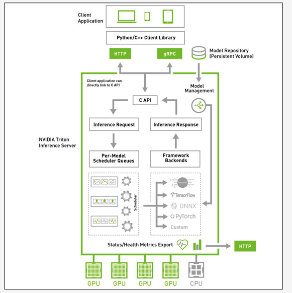

# Triton 学习
## 一、Triton 架构
Triton 架构图如下所示，

Triton 推理服务器采用属于 “主从（client-server）” 架构的系统，由图中的四个板块所组成：
### 1.1 模型仓（Model Repostory）
存放 Triton 服务器所要使用的模型文件与配置文件的存储设备，可以是本地服务器的文件系统，也可以使用 Google、AWS、Azure 等云存储空间，**只要遵循 Triton 服务器所要求的规范就可以**

### 1.2 客户端应用（Client Application）
基于 Triton 用户端 Python / C++ / Java 库所撰写，可以在各种操作系统与 CPU 架构上操作，对 Triton 服务器提交任务请求，并且接受返回的计算结果。这是整个 Triton 推理应用中代码量最多的一部分，也是开发人员需要花费最多心思的部分，在后面会有专文讲解。

### 1.3 HTTP / gPRC 通讯协议
作为用户端与服务端互动的通讯协议，开发人员可以根据实际状况选择其中一种通讯协议进行操作，能透过互联网对服务器提出推理请求并返回推理结果.

### 1.4 推理服务器（Inference Server）
这是整个 Triton 服务器最核心且最复杂的部分，特别在 “性能”、“稳定”、“扩充” 这三大要求之间取得平衡的管理，主要包括以下几大功能板块：
+ C 开发接口
  在服务器内的代码属于系统底层机制，主要由 NVIDIA 系统工程师进行维护，因此只提供性能较好的 C 开发接口，一般应用工程师可以忽略这部分，除非您有心深入 Triton 系统底层进行改写。
+ 模型管理器（Model Management）
  支持多框架的文件格式并提供自定义的扩充能力，目前已支持 TensorFlow 的 GraphDef 与 SavedModel 格式、ONNX、PyTorch TorchScript、TensorRT、用于基于树的 RAPIDS FIL 模型、OpenVINO 等模型文件格式，还能使用自定义的 Python / C++ 模型格式；
+ 模型的推理队列调度器（Per-Model Scheduler Queues）
  将推理模型用管道形式进行管理，将一个或多个模型的预处理或后处理进行逻辑排列，并管理模型之间的输入和输出张量的连接，任何的推理请求都会触发这个模型管道。这部分还包含以下两个重点：
  + 并发模型执行（Concurrent Model Execution）
    允许同一模型的多个模型和 / 或多个实例在同一系统上并行执行，系统可能有零个、一个或多个 GPU。
  + 模型和调度程序（Models And Schedulers)
    支持多种调度和批量处理算法，可为每个模型单独选择无状态（stateless）、有状态（stateful）或集成（ensemble）模式。对于给定的模型，调度器的选择和配置是通过模型的配置文件完成的。
  + 计算资源的优化处理
    这是作为服务器软件的最重要工作之一，就是要将设备的计算资源充分调度，并且优化总体计算性能，主要使用以下三种技术。
    + 支持异构计算模式
        可部署在纯 x86 与 ARM CPU 的计算设备上，也支持装载 NVIDIA GPU 的计算设备。
    + 动态批量处理（Dynamic batching）技术
        对支持批处理的模型提供多个内置的调度和批处理算法，并结合各个推理请求以提高推理吞吐量，这些调度和批量处理决策对请求推理的客户端是透明的。
    + 并发模型（Concurrent model）
      多个模型或同一模型的多个实例，可以同时在一个 GPU 或多个 GPU 上运行，以满足不同的模型管理需求。
  + 框架后端管理器（Framework Backends
    Triton 的后端就是执行模型的封装代码，每种支持的框架都有一个对应的后端作为支持，例如 tensorrt_backend 就是支持 TensorRT 模型推理所封装的后端、openvino_backend 就是支持 openvine 模型推理所封装的后端，扩展：每个实例都可以在 Kubernetes 环境中独立扩展，以获得最佳性能。通过这种新的集成，可以轻松地在 Kubernetes 使用 Triton 部署高性能推理。