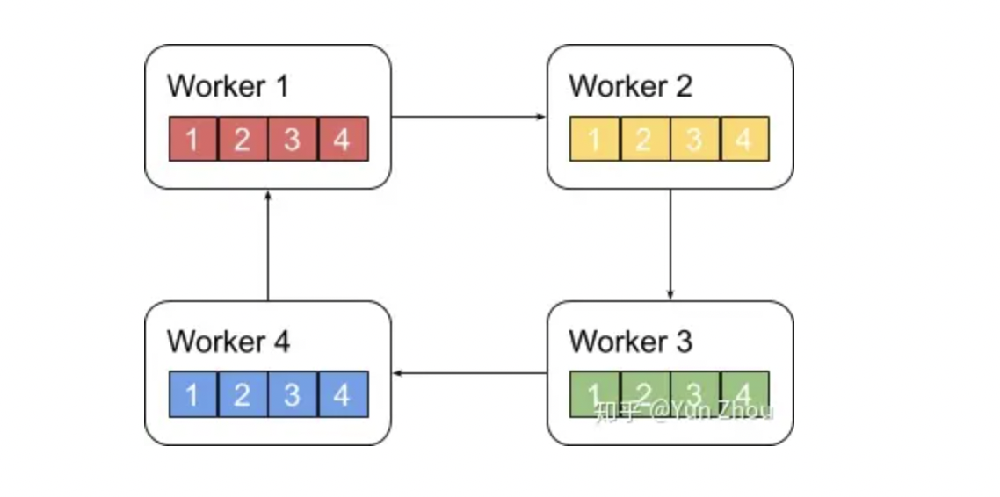
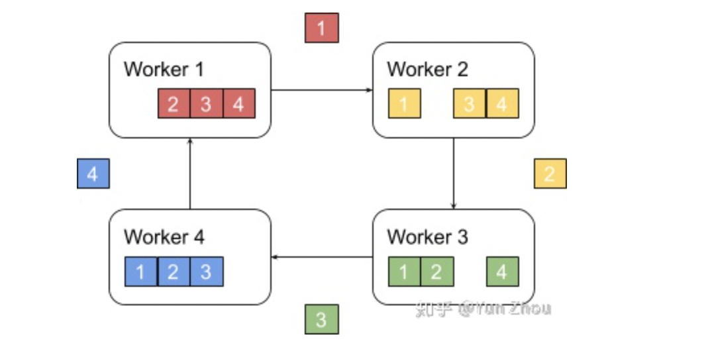
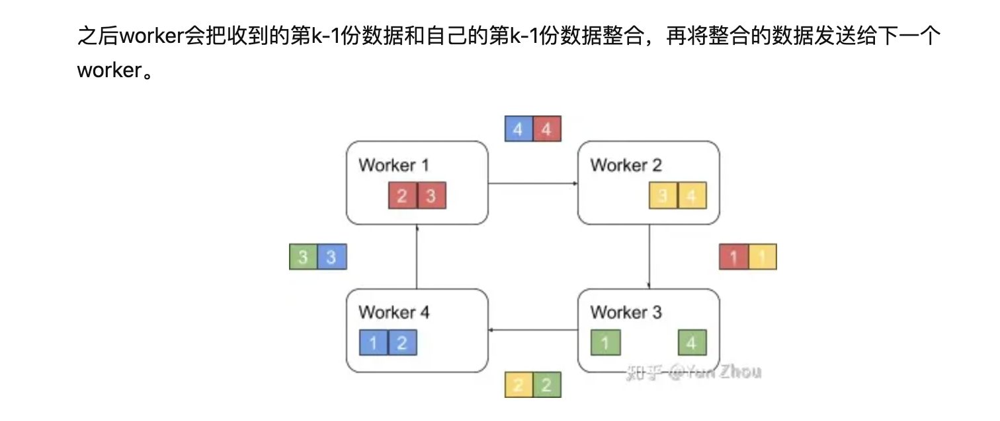
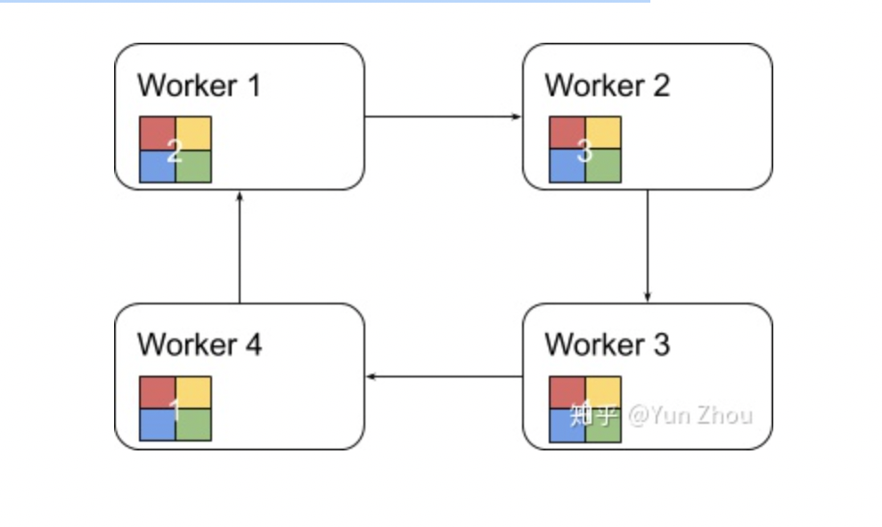

# 大模型分布式训练并行技术

通过本篇文档你将了解到什么？
1. 分布式训练相关概念
2. 分布式训练架构
3. 分布式并行策略

分布式训练解决的问题？
- 将训练任务按照一定方法拆分到多个计算节点进行计算，再按照一定的方法对拆分后计算得到的信息，一般是梯度信息或基于梯度更新后的参数信息，进行聚合。这个拆分可以采用多种不同的方式，一般统称为 『并行方式』，而信息聚合的方式可以称为 『模型更新传递方式』。

## 一、 分布式训练架构

虽然训练任务可以拆分，但是一个 Batch 数据训练完成后，下一个 Batch 的数据训练开始之前，必须先更新 Worker 上的模型参数，因此模型参数的更新传递是分布式训练中非常重要的一环，模型参数信息的传递方式和更新频率都会直接影响模型的最终结果：
+ 传递方式：分布式训练硬件资源选用的组织架构类型
    + 中心化服务架构 - 参数服务器架构
    + 去中心化服务架构 - Collective 架构
+ 传递时机
    + 同步更新
    + 异步更新

### 1.1 参数服务器（PS）架构 （中心化）- 参数统一由 Server 更新和分发

参数服务器架构主要包含 Server 和 Worker 两个部分，其中 Server 负责参数的存储和更新，Worker 负责训练。当训练数据过多，一个 Worker 训练太慢时，可以引入多个 Worker 同时训练，Worker 之间需要同步模型参数。Server 充当 Worker 之间参数交换的媒介。当模型参数过大导致 Server 是一个瓶颈时，就需要引入多个 Server。


+ 参数更新流程：
    + 数据划分：
        + 训练数据均匀的分给不同的 Worker。
    + 梯度计算：由 Worker 端执行
        + 读取分配的数据
        + 从 Server 端拉取最新的模型参数
        + 前向 + 反向 计算损失函数的梯度（对所有参数的梯度）
        + 发送给参数服务器
    + 梯度聚合：由 Server 端执行
        + 接收 Worker 端发来的所有参数梯度信息
        + 以某种算法对各个 Worker 发来的参数梯度信息进行聚合（平均或其他方式） ，对所有参数得到一个聚合后全局梯度。
    + 全局梯度应用： 由 Server 端执行
        + 参数服务器将全局梯度应用于模型参数，对参数进行更新。
    + 更新分发：
        + 更新后的模型参数，等待下一次迭代，Worker 端的请求
    + 迭代更新
        + 以上步骤在每一轮迭代中重复进行，直到模型收敛或达到预设的迭代次数。

+ Server 端以何种方式进行参数更新(根据 Server 端是否等待所有 Worker 执行完在同步参数分为如下几种方式)：
    + 同步训练
        + 所有 Worker 进度保持一致，每训练完一个 Batch 后，Worker 节点会上传梯度，然后等待 Server 拿到所有 Worker 节点上传的梯度后，才会进行更新。
        + 训练速度取决于最慢的那个节点，木桶原理。
        + 特点：每个 batch 训练的时候，所有 Worker 拿到的模型参数都是一样的。模型容易收敛。
    + 异步训练
        + 异步训练过程中，每个 Worker 之间的参数更新互不影响。
        + 每一个 Worker 完成梯度计算后，会立即上传给 Server，Server 会根据该梯度立即更新参数结果并返回给相应的 Worker 节点。Worker 拿到最新的参数后，该 Worker 会立即开始新一轮的训练。
        + 特点：每个 Worker 在训练过程中，参数都是不一样的。模型不容易收敛
    + GEO 异步训练
        + 每个 Worker 节点本地都会拥有完整的训练流程（前向->反向->参数更新），训练过程中任意两个节点之间的参数更新都互不影响。
        + 当训练多个 batch，达到一定的轮次（Step）时，Worker 节点会将本地的参数计算一次差值（Step 间隔带来的差值），将差值发送给服务端进行累积更新，Worker 拿到最新的参数后，会立即开始新一轮的训练。

+ 参数服务器架构使用场景：对于存储超大规模模型参数的训练场景十分友好，常被用于训练拥有海量稀疏参数的搜索推荐领域模型。

### 1.2  集合通信架构（All-Reduce Collective）- 参数由 Worker 之间互相同步

Collective 架构是一种去中心化的、基于规约模式的架构，也是近年来非常流行的分布式训练架构。该架构没有所谓管理模型参数的中心节点，每个设备都是Worker，节点间通过 Collective 集合通信原语通信，因此也成为 Collective 架构。一种典型的集合通信原语是基于 NVIDIA NCCL 通信库的集合通信原语。

+ 什么是集合通信原语？
    + 集合通信 （Collective Communications） 是一个进程组的所有进程都参与的全局通信操作，其最为基础的操作有：
        - 发送 send
        - 接收 receive
        - 复制 copy
        - 组内进程栅障同步 barrier
        - 节点间的进程同步 （signal + wait）
    + 通信原语： 上述几个基本的操作组合构成了一组通信模板，也叫通信原语
        - 一对多的广播 broadcast
        - 多对一的收集 gather
        - 多对多的收集 all-gather
        - 1对多的发散 scatter
        - 多对一的规约 reduce
        - 多对多的规约 all-reduce
        - 组合的规约与发散 reduce-scatter
        - 多对多的 all-to-all 等
    + 参考链接： 分布式训练—集合通信及其通信原语 - (https://blog.csdn.net/weixin_44966641/article/details/131756853)
    + 这些通信原语都是以算子的形式出现，同一类算法根据硬件不同，调用的底层通讯库接口不同，所以实现区分不同硬件。例如在 Paddle 代码中：通信库算子实现在
    
    其中，xpu 算子基于 xpu BKCL 通信库实现，gpu 算子基于 NCCL 或 RCCL 通信库实现。


+ 集合通信架构：各个 worker 之间点对点通信，进行参数更新。当对所有样本产生的参数梯度进行全局同步后，由每个 Worker 独立执行优化算法，相当于优化了全局的模型参数。
    - 方式一（简单）
        - 每个worker将自己的数据发给其他的所有worker，然而这种方式存在大量的浪费。
        
    - 方式二
        - 主从式架构 - 将一个worker设为master，其余所有worker把数据发送给master之后，由master进行整合元算，完成之后再分发给其余worker。不过这种实现 master往往会成为整个网络的瓶颈。
        
    - 方式三
        - Ring AllReduce
        
        阶段一： 将 N 个 Worker 分布在一个环上，并且把每个 Worker 的数据分成 N 份。

        

        接下来我们具体看第k个worker，这个worker会把第k份数据发给下一个worker，同时从前一个worker收到第k-1份数据。

        

        之后worker会把收到的第k-1份数据和自己的第k-1份数据整合，再将整合的数据发送给下一个worker。

        

        以此循环N次之后，每一个worker都会包含最终整合结果的一份。

        

        第二阶段，每个worker将整合好的部分发送给下一个worker。worker在收到数据之后更新自身数据对应的部分即可。

        假设每个worker的数据是一个长度为S的向量，那么个Ring AllReduce里，每个worker发送的数据量是O(S)，和worker的数量N无关。这样就避免了主从架构中master需要处理O(S*N)的数据量而成为网络瓶颈的问题。

+ 集合通信架构使用场景：该架构往往是由高算力计算芯片通过高速网络互联而成，如高性能计算的 GPU 之间的高速网络互联 NVLINK 和 InfiniBand 等，该架构对于计算密集的任务非常友好， 因此非常适合 CV 和 NLP 领域的计算密集型训练任务。例如机器翻译中的Transformer，图像分类中的ResNet50，语音识别中的DeepSpeech2通常都是采用这种训练架构完成。

### 1.3 如何理解分布式训练架构
分布式训练架构无论是 PS 架构还是 Collective 架构，他们只是一种编程范式，大家处理的任务都是一样的，旨在描述训练任务如何切分，梯度如何聚合，参数如何更新，提高训练速度。反应到底层，无非是计算图的不同，根据目标训练硬件的计算效率 + 通信库效率等因素，在根据不同的业务场景选择不同的方法。


### 2.1 分布式训练的并行方式

#### 2.1.1 数据并行

数据并行，是最常见的并行形式，因为它很简单。 在数据并行训练中，数据集被分割成几个碎片，每个碎片被分配到一个设备上，每个设备将持有一个完整的模型副本，并在分配的数据集碎片上进行训练。在反向传播之后，模型的梯度将被全部减少，以便在不同设备上的模型参数能够保持同步。典型的数据并行实现：PyTorch DDP。


#### 2.1.2 模型并行
在数据并行训练中，一个明显的特点是每个 GPU 持有整个模型权重的副本。这就带来了一些冗余问题。另外一种并行模式是模型并行，即模型被分割并分布在一个设备阵列上。通常有两种类型的模型并行： 张量并行和流水线并行。
- 张量并行 - 层内并行，在一个操作中进行并行计算 如：矩阵乘法。
- 流水线并行 - 层间并行，在各层之间进行并行计算。


##### 2.1.2.1 张量并行
张量并行训练是将一个张量沿特定维度分成 N 块，每个设备只持有整个张量的 1/N，同时不影响计算图的正确性。这需要**额外的通信**来确保结果的正确性。

以一般的矩阵乘法为例，假设我们有 C = AB。我们可以将B沿着列分割成 [B0 B1 B2 ... Bn]，每个设备持有一列。然后我们将 A 与每个设备上 B 中的每一列相乘，我们将得到 [AB0 AB1 AB2 ... ABn] 。此刻，每个设备仍然持有一部分的结果，例如，设备(rank=0)持有 AB0。为了确保结果的正确性，我们需要收集全部的结果，并沿列维串联张量。通过这种方式，我们能够将张量分布在设备上，同时确保计算流程保持正确。典型的张量并行实现：Megatron-LM（1D）、Colossal-AI（2D、2.5D、3D）。


##### 2.1.2.2 流水线并行
流水线并行的核心思想是，模型按层分割成若干块，每块都交给一个设备。
- 在前向传播过程中，每个设备将中间激活传递给下一个阶段。
- 在后向传播中，每个设备将输入张量的梯度传回给前一个流水线阶段。

这允许设备同时进行计算，从而增加训练的吞吐量。


流水线并行训练的一个明显缺点是：训练设备容易出现空闲状态（因为后一个阶段需要等待前一个阶段执行完），导致计算资源的浪费，加速效率没有数据并行高。
典型的流水线并行实现：GPipe、PipeDream、PipeDream-2BW、PipeDream Flush（1F1B）。

1. 朴素流水线并行

模型按层间切分成多个部分，并将每个部分分配给一个 GPU。在模型切分成多个部分的边界处进行通信。


- 4 层网络朴素流水线示意


这里仅使用了点到点通信（MPI.Send 和 MPI.Recv），并且不需要任何集体通信原语（因此，不需要 MPI.AllReduce）

- 朴素流水线并行存在的问题
    - 任意给定时刻，除了一个 GPU 之外的所有 GPU 都是空闲的。因此，如果使用 4 个 GPU, 则几乎等同于单个 GPU 的内存量增加 4 倍，而其他计算资源没有运用上。所以朴素流水线会存在很多的 bubble，朴素流水线将会导致 **GPU 使用率过低**。 
    - 数据通信开销： 1 张 24 GB GPU 卡训练速度 >  4 张 6 GB GPU 卡训练速度 , 因为后者没有数据通信开销。
    - 通信和计算没有并行
    - 内存占用大：先执行前向传播的GPU（如：GPU1）将保留整个 batch 缓存的所有激活，直到最后。如果batch size很大，可能会产生内存问题。

2. 微批次流水线并行

微批次（MicroBatch）流水线并行与朴素流水线几乎相同，但它通过将传入的小批次（minibatch）分块为微批次（microbatch），并人为创建流水线来解决 GPU 空闲问题，从而允许不同的 GPU 同时参与计算过程，可以显著提升流水线并行设备利用率，减小设备空闲状态的时间。目前业界常见的流水线并行方法 GPipe 和 PipeDream 都采用微批次流水线并行方案。

+ 2.1 GPipe
    
    GPipe（Easy Scaling with Micro-Batch Pipeline Parallelism），由谷歌提出的一种流水线并行方案。GPipe 流水线并行主要用来解决两个问题
    - **提高模型训练的并行度**
        - Gpipe 在朴素流水线并行的基础上，利用数据并行的思想，将 mini-batch 细分为多个更小的 micro-batch，送入GPU进行训练，来提高并行程度。
        - 朴素流水线与 GPipe 微批次流水线并行对比，通过 GPipe 可以有效降低流水线并行 bubble 空间的比例。
            
    - **通过重计算降低显存消耗**
        - 在模型训练过程中的前向传播时，会记录每一个算子的计算结果，用于反向传播时的梯度计算。
            
        - **重计算并非是不需要中间结果，而是有办法在求导过程中实时的计算出之前被舍弃掉的中间结果** 
        - 重计算可以不用保存中间层输出的激活值，在计算梯度的时候会重新计算出来这些激活值从而可以计算梯度。在 GPipe 中，应用了这个技术后，如果一个设备上有多层，那么就可以只保存多层中的最后一层的输出值。这样就降低了每个设备上内存占用峰值，同样的模型尺寸需要的显存就少了。

    简而言之，GPipe 通过纵向对模型进行切分解决了单个设备无法训练大模型的问题；同时，又通过微批量流水线增加了多设备上的并行程度，除此之外，还使用重计算技术降低了单设备上的显存峰值。

+ 2.2 流水线并行策略
    + F-then-B 策略  
        F-then-B 模式，先进行前向计算，再进行反向计算。F-then-B 模式由于缓存了多个 micro-batch 的中间变量和梯度，**显存的实际利用率并不高**。
        
    + 1F1B 策略 
        1F1B（One Forward pass followed by One Backward pass）模式，一种前向计算和反向计算交叉进行的方式。在 1F1B 模式下，前向计算和反向计算交叉进行，可以及时释放不必要的中间变量。

        1F1B 示例如下图所示，以 stage4 的 F42（stage4 的第 2 个 micro-batch 的前向计算）为例，F42 在计算前，F41 的反向 B41（stage4 的第 1 个 micro-batch 的反向计算）已经计算结束，即可释放 F41 的中间变量，从而 F42 可以复用 F41 中间变量的显存。

        

        研究表明，1F1B 方式相比于 F-then-B 方式，**峰值显存可以节省 37.5%，对比朴素流水线并行峰值显存明显下降，设备资源利用率显著提升**。

#### 4.1.3 经典实现
##### 4.1.3.1 PyTorch DP
- 介绍

    数据并行(torch.nn.DataParallel)，这是Pytorch最早提供的一种数据并行方式，它基于**单进程多线程**进行实现的，它使用一个进程来计算模型权重，在**每个批处理期间**将数据分发到每个GPU。所以说他是一种同步训练的方式。

- 计算流程
    - 将 inputs 从主 GPU 分发到所有 GPU 上。
    - 将 model 从主 GPU 分发到所有 GPU 上。
    - 每个 GPU 分别独立进行前向传播，得到 outputs。
    - 将每个 GPU 的 outputs 发回主 GPU。
    - 在主 GPU 上，通过 loss function 计算出 loss，对 loss function 求导，求出损失梯度。
    - 计算得到的梯度分发到所有 GPU 上。
    - 反向传播计算参数梯度。
    - 将所有梯度回传到主 GPU，通过梯度更新模型权重。
    - 不断重复上面的过程。


- 流程示意简化
```
                            主进程 Master GPU
                                    |
                                分发数据和模型
                                    |
        -  -  -  -  -  -  -  -  -  -  -  -  -  -  -  -  -  -  -
        |                  |               |                |
    Worker GPU 1       Worker GPU 2     ......         Worker GPU N
        |                  |               |                |
        前向计算             前向计算          前向计算          前向计算
        |                  |               |                |
        output 1           output 2       ......            output N
        |                  |               |                |
        -  -  -  -  -  -  -  -  -  -  -  -  -  -  -  -  -  -  -
                                    |
                            主进程  Master GPU
                                    |
                        收集 output 1 ~ N 并计算 Loss 
                                    |
                        对 loss function 求导，求出损失梯度
                                    |
        -  -  -  -  -  -  -  -  -  -  -  -  -  -  -  -  -  -  - 
        |                  |               |                 |
    Worker GPU 1       Worker GPU 2       ......         Worker GPU N
        |                  |               |                 |
        反向计算             反向计算          反向计算          反向计算
        |                  |               |                 |
        梯度 1              梯度 2            ......           梯度 N
        |                  |               |                 |
        -  -  -  -  -  -  -  -  -  -  -  -  -  -  -  -  -  -  -
                                    |
                            主进程  Master GPU
                                    |
                            汇总梯度 1 ~ N                                       
                                    |                                             
                        根据汇总梯度得到的值，使用梯度下降法更新模型权重                
                                    |                                             
                                    |  Loop
                            
```

- 缺点
    - 单进程多线程带来的问题：DataParallel使用单进程多线程进行实现的，方便了信息的交换，但受困于 GIL，会带来性能开销，速度很慢。而且，只能在单台服务器（单机多卡）上使用（不支持分布式）。同时，不能使用 Apex 进行混合精度训练。
        - Tips: GIL 锁如何影响 python 多线程：https://blog.csdn.net/u013531487/article/details/131321794
    - 效率问题，主卡性能和通信开销容易成为瓶颈，GPU 利用率通常很低：数据集需要先拷贝到主进程，然后再分片（split）到每个设备上；权重参数只在主卡（GPU0）上更新，需要每次迭代前向所有设备做一次同步；每次迭代的网络输出需要聚集到主卡（GPU0）上。因此，通信很快成为一个瓶颈。除此之外，这将导致主卡和其他卡之间，GPU利用率严重不均衡（比如：主卡使用了10G显存，而其他卡只使用了2G显存，batch size稍微设置大一点主卡的显存就OOM了）。
    - 不支持模型并行，由于其本身的局限性，没办法与模型并行组合使用.

##### 4.1.3.2 PyTorch DDP
    - 介绍

    分布式数据并行(torch.nn.DistributedDataParallel)，基于多进程进行实现的，每个进程都有独立的优化器，执行自己的更新过程。每个进程都执行相同的任务，并且每个进程都与所有其他进程通信。进程（GPU）之间只传递梯度，这样网络通信就不再是瓶颈。

    

- 计算流程
    - 首先将 rank=0 进程中的模型参数广播到进程组中的其他进程；
    - 然后，每个 DDP 进程都会创建一个 local Reducer 来负责梯度同步。
    - 在训练过程中，每个进程从磁盘加载 batch 数据，并将它们传递到其 GPU。每个 GPU 都有自己的前向过程，完成前向传播后，梯度在各个 GPUs 间进行 All-Reduce，每个 GPU 都收到其他 GPU 的梯度，从而可以独自进行反向传播和参数更新。
    - 同时，每一层的梯度不依赖于前一层，所以梯度的 All-Reduce 和反向过程同时计算，以进一步缓解网络瓶颈。 -- Tips: 反向随机传播算法
    - 在反向过程的最后，每个节点都得到了平均梯度，这样各个 GPU 中的模型参数保持同步。

- DP 和 DDP 的区别
    + 实现方式不同
        + DP 是基于单进程多线程的实现，只用于单机情况
        + DDP 是多进程实现的，每个 GPU 对应一个进程，适用于单机和多机情况，真正实现分布式训练，并且因为每个进程都是独立的 Python 解释器，DDP 避免了 GIL 带来的性能开销。
    + 参数更新的方式不同
        + DDP 在各进程梯度计算完成之后，各进程需要将梯度进行汇总平均，然后在由 rank=0 的进程，将其广播到所有进程，各进程用该梯度来独立更新参数
        + DP 是梯度汇总到 GPU0, 由 GPU0 进行更新参数，在广播给其他剩余的 CPU
        + DDP 传输的数据更少，训练更高效，不存在 DP 中负载不均衡的问题。
    + DDP 支持模型并行，而 DP 不支持，这意味如果模型太大单卡显存不足时，只能使用DDP。

##### 4.1.3.3 Pytorch FSDP (完全分片数据并行)

Pytorch FSDP  受 DeepSpeed ZeRO 启发而获得灵感

1. 思考： GPT-2 模型参数 1.5B, 权重只需要 3GB 如果用 16-bit 精度存储，但是用单 GPU（32 GB） 使用 tensorflow 或 pytorch 却训练不起来， 那么这些内存都去哪儿了？ 

ZeRO 将模型训练阶段， 每张卡种的显存内容分为两类：
+ 模型状态：
    - 优化器状态
        - Adam 优化器
            - momentum
            - variance
        - 混合精度优化器（Mixed-Precision Training） 
            - 参数和激活都以 fp16 存储
            - 保存权重 fp32 的副本以及其他有关 fp32 类型的优化器状态副本
            - model (假设模型参数量大小为 N)
                - fp16 权重大小 2N
                - fp16 权重梯度大小 2N
                - 优化器状态(占比过高)：
                    - fp32 权重大小  4N
                    - fp32 momentum 大小 4N
                    - fp32 variance 大小 4N
                    - 其他额外内存： KN (K 是优化器状态的内存乘数), 其中 Adam 混合精度优化器中： K = 12
                    备注： 优化器状态的内存乘数（K）是指存储优化器状态所需的额外内存量。这个概念主要用于混合精度训练，表示每个浮点运算需要的额外内存。K值的计算与模型大小、DP并行度以及GPU有关。
    - gradients
    - weights
+ 剩余状态（碎片内存）
    - 激活值
        - sequence length of 1K
        - batch size of 32 
        需要 60GB 的内存  -> 通过 checkpointing 技术 -> 8GB
    - 临时 buffer
        - 存储中间结果
        - all-reduce, gradient norm
    - 内存碎片
        - 请求如果没有足够的连续内存来满足它，即使总的可用内存内存大于请求的内存。我们在训练时观察到显著的记忆碎片
非常大的型号，导致内存不足问题，中仍有超过30%的内存可用一些极端情况。

通常来说，在模型训练的过程中，GPU 上需要进行存储的参数包括了模型本身的参数、优化器状态、激活函数的输出值、梯度以及一些临时的 Buffer。各种数据的占比如图所示：


可以看到模型参数仅占模型训练过程中所有数据的一部分，当进行混合精度运算时，其中模型状态参数(优化器状态 + 梯度+ 模型参数）占到了一大半以上。因此，我们需要想办法去除模型训练过程中的冗余数据。

2. ZeRO 优化
+ 2.1 ZeRO-DP (对模型状态进行优化)
    + DP比MP具有更好的扩展效率，因为MP降低了计算的粒度，同时也增加了通信开销。在超过某个点后，较低的计算粒度会降低每个GPU的效率，而增加的通信开销会阻碍跨GPU的可扩展性，特别是在跨越节点边界时。相反，DP具有更高的计算粒度和更低的通信量，因此可实现更高的效率。
    + DP由于在所有数据并行进程中冗余地存储了模型状态，因此DP是内存不高效的。相反，MP对模型状态进行分区以获得内存效率。
    + DP和MP都保留整个训练过程中所需的所有模型状态，但并不是所有状态都需要一直存在。例如，对应于每个层的参数仅在层的正向传播和反向传播期间需要。这表示，可以分别保存每个层的参数，并在训练期间按需加载。此外，如果正在训练特定场景，则只需要加载与该场景相关的参数。这可以显著降低训练期间所需的内存量，尤其是在大型模型的情况下。

ZeRO-DP在保留DP的训练效率的同时实现了MP的内存效率, ZeRO-DP 对模型状态进行分区而不是复制它们（第5节），并使用动态通信调度，利用模型状态的内在时间性，同时最小化通信量（第7节）。通过这样做，ZeRO-DP随着DP程度的增加线性地减少了模型的每个设备的内存占用，同时保持通信量接近默认的DP，保留了效率。

+ 2.2 ZeRO-R (对剩余状态进行优化)
    + 减少激活内存占用
        - MP对模型状态进行分区，但通常需要复制激活内存。例如，如果我们将线性层的参数垂直分割并在两个GPU上并行计算，则每个GPU都需要整个激活来计算其分区
        - 对于GPT-2或更大模型，算术强度（每次迭代中计算量与每次迭代中激活检查点的量之比）非常大（≥10K），并且随着隐藏维度线性增加，使得即使带宽较低也可以隐藏激活检查点的数据移动成本。
        
        ZeRO通过将激活检查点分区到GPU上，消除了MP中的内存冗余，并使用allgather按需重构它们。激活内存占用减少了与MP程度成比例。对于非常大的模型，ZeRO甚至可以选择将激活分区移动到CPU内存中，同时由于这些模型中的算术强度很大而仍然实现良好的效率。
    + 管理临时 buffer
        - ZeRO-R使用恒定大小的缓冲区，以避免随着模型大小的增加临时缓冲区爆炸，同时使其足够大以保持高效。
    + 碎片内存管理
        - 内存碎片是短生命周期和长生命周期内存对象交织的结果。在前向传播期间，激活检查点具有长生命周期，但是重新计算的激活具有短生命周期。类似地，在反向计算期间，激活梯度具有短生命周期，而参数梯度具有长生命周期。ZeRO通过将激活检查点和梯度移动到预先分配的连续内存缓冲区来实现内存的动态碎片整理。这不仅增加了内存可用性，还减少了内存分配器查找连续空闲内存所需的时间，从而提高效率。

针对模型状态的存储优化（去除冗余），DeepSpeed 提出了 ZeRO，ZeRO 使用的方法是分片，即每张卡只存 1/N 的模型状态量，这样系统内只维护一份模型状态参数。

ZeRO对 模型状态（Model States）参数进行不同程度的分割，主要有三个不同级别：
+ ZeRO-1 : 优化器状态分片（ Optimizer States Sharding）
+ ZeRO-2 : 优化器状态与梯度分片（Optimizer States & Gradients Sharding）
+ ZeRO-3 : 优化器状态、梯度和模型权重参数分片（Optimizer States & Gradients & Parameters Sharding）

ZeRO 不同 stage 内存使用情况：


### 4.2 模型并行
#### 4.2.1 张量并行

#### 4.2.2 流水线并行


### 4.3 


## 五、 分布式框架


## 六、 常见加速库

## QA
1. Q: 异步训练参数不同步模型如何收敛?
A: 异步训练中，不同节点上的模型参数可能会存在一定的偏差，这可能会影响模型的收敛。然而，在异步训练中，每个节点都会独立地进行反向传播和参数更新，最终的模型参数是由多个节点的参数更新平均得到的。这种更新方式类似于在多个副本上进行同步训练，然后对结果进行合并。
为了保证模型的收敛，可以采用一些技巧来减少不同节点之间的参数偏差。一种方法是采用折扣因子，对较早的参数更新进行折扣，使得最新的参数更新对模型的影响更大。另一种方法是采用平均策略，对不同节点的参数进行平均，以得到最终的模型参数。
此外，还可以采用一些调整参数更新的方法来提高模型的收敛性能。例如，可以采用Momentum方法来加速模型收敛，或者采用Adam等自适应学习率方法来自动调整学习率。
综上所述，异步训练虽然存在参数不同步的问题，但是在采取一些技巧和方法后，仍然可以实现模型的收敛。同时，需要注意对模型进行适当的调整和优化，以提高模型的性能和稳定性。