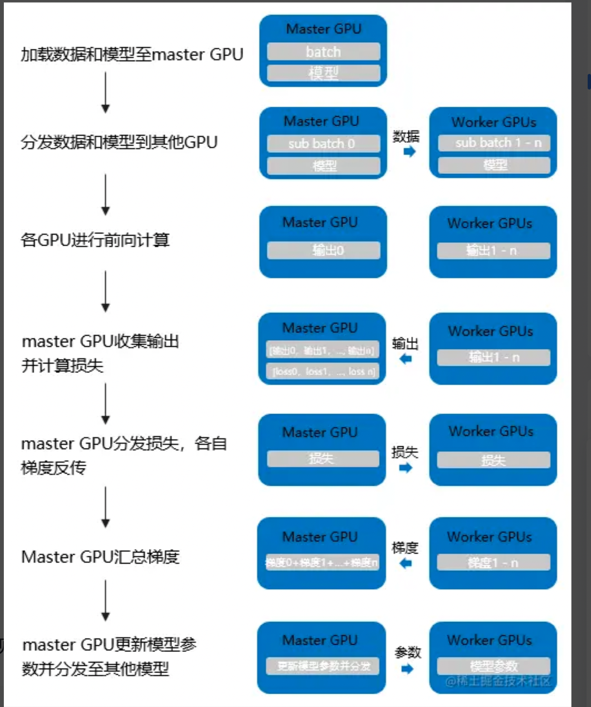

# 大模型分布式训练并行技术
## 一、 基础知识碎片
1. 深度学习训练的本质是什么？ 

    人工神经网络去拟合数据集，更新模型权值以最小化损失函数, 使得训练的模型在实际表现中泛化能力好，解决特定的任务。

2. 神经网络的训练方法(反向传播 + 梯度下降)
    + 梯度下降
        - 批量梯度下降法（Batch Gradient Descent，BGD）
        - 随机梯度下降法（Stochastic Gradient Descent，SGD）
        - 小批量梯度下降法（Mini-batch Gradient Descent）
            - 参考链接：https://baijiahao.baidu.com/s?id=1620824620321764749&wfr=spider&for=pc
    + 训练流程
        + 计算图前向传播
            - 求预测值和真实值的损失误差
        + 反向传播 + 梯度下降
            - 将输出误差反向传播给网络参数，以此来拟合样本的输出。本质上是最优化的一个过程，逐步趋向于最优解。
    + 举个栗子
        - 三层网络表示
            
        - 网络用数学公式表示
            
        - 步骤一：前向传播得到损失误差
            - 得到误差后,如何调整权重让误差不断进行减小?
            - 误差 E 是关于权重 w 的函数，如何找到使得损失函数值最小的 w.
        - 步骤二: 最优化（梯度下降）
            
            参数的更新依赖于每一次迭代训练的样本。
    
    注: 训练数据只用于前向传播计算误差，反向传播的网络输入使用的是计算出来的误差进行传递，误差传递按同样按照计算图相应的拓扑顺序进行传递。

3. 理解反向传播是如何并行的？每个 GPU 都做了什么事情？
    + 要做的事情： 计算梯度 + 参数更新
    + 明白一个问题：划重点：反向传播计算过程中，第 i 层参数的梯度不依赖于第 i+1 层的参数梯度，但依赖于第 i+1 层的输入梯度。
    
    + 那么参数如何更新？
        - 每一层参数的更新都是独立的，不依赖于其他层参数的更新。
        - 反向计算按照网络拓扑顺序 顺序执行，更新该层的参数
        - 每个 GPU 负责不同部分网络参数的更新，其他层的参数，可以通过 AllReduce 算法进行同步。
        通过 参数同步(AllReduce) + 分层参数更新(每个 GPU 负责不同层的参数更新) 可以做到分布式并行。

3. 分布式训练解决的问题？
找到一种训练策略，完成模型的训练。例如如何进行参数的更新？如何进行训练数据的切分等等。

## 二、 分布式训练架构
### 2.1 PS 架构


### 2.2 Ring AllReduce

## 三、 分布式并行模式
### 3.1 同步训练


### 3.2 异步训练

## 四、 分布式训练策略

### 4.1 数据并行
#### 4.1.1 定义
    数据并行，是最常见的并行形式，因为它很简单。 在数据并行训练中，数据集被分割成几个碎片，每个碎片被分配到一个设备上，每个设备将持有一个完整的模型副本，并在分配的数据集碎片上进行训练。在反向传播之后，模型的梯度将被全部减少，以便在不同设备上的模型参数能够保持同步。示意图如下：


 - 思考？
    + 数据如何进行拆分？
    + 参数如何进行更新同步？


#### 4.1.3 经典实现
1. PyTorch DP
    - 介绍
    
        数据并行(torch.nn.DataParallel)，这是Pytorch最早提供的一种数据并行方式，它基于**单进程多线程**进行实现的，它使用一个进程来计算模型权重，在**每个批处理期间**将数据分发到每个GPU。所以说他是一种同步训练的方式。

    - 计算流程
        - 将 inputs 从主 GPU 分发到所有 GPU 上。
        - 将 model 从主 GPU 分发到所有 GPU 上。
        - 每个 GPU 分别独立进行前向传播，得到 outputs。
        - 将每个 GPU 的 outputs 发回主 GPU。
        - 在主 GPU 上，通过 loss function 计算出 loss，对 loss function 求导，求出损失梯度。
        - 计算得到的梯度分发到所有 GPU 上。
        - 反向传播计算参数梯度。
        - 将所有梯度回传到主 GPU，通过梯度更新模型权重。
        - 不断重复上面的过程。

    

    - 流程示意简化
    ```
                               主进程 Master GPU
                                      |
                                  分发数据和模型
                                      |
            -  -  -  -  -  -  -  -  -  -  -  -  -  -  -  -  -  -  -
            |                  |               |                |
        Worker GPU 1       Worker GPU 2     ......         Worker GPU N
            |                  |               |                |
         前向计算             前向计算          前向计算          前向计算
            |                  |               |                |
          output 1           output 2       ......            output N
            |                  |               |                |
            -  -  -  -  -  -  -  -  -  -  -  -  -  -  -  -  -  -  -
                                      |
                                主进程  Master GPU
                                      |
                            收集 output 1 ~ N 并计算 Loss 
                                      |
                            对 loss function 求导，求出损失梯度
                                      |
            -  -  -  -  -  -  -  -  -  -  -  -  -  -  -  -  -  -  - 
            |                  |               |                 |
        Worker GPU 1       Worker GPU 2       ......         Worker GPU N
            |                  |               |                 |
         反向计算             反向计算          反向计算          反向计算
            |                  |               |                 |
         梯度 1              梯度 2            ......           梯度 N
            |                  |               |                 |
            -  -  -  -  -  -  -  -  -  -  -  -  -  -  -  -  -  -  -
                                      |
                                主进程  Master GPU
                                      |
                                汇总梯度 1 ~ N                                       
                                      |                                             
                            根据汇总梯度得到的值，使用梯度下降法更新模型权重                
                                      |                                             
                                      |  Loop
                                
    ```

    - 缺点
        - 单进程多线程带来的问题：DataParallel使用单进程多线程进行实现的，方便了信息的交换，但受困于 GIL，会带来性能开销，速度很慢。而且，只能在单台服务器（单机多卡）上使用（不支持分布式）。同时，不能使用 Apex 进行混合精度训练。
            - Tips: GIL 锁如何影响 python 多线程：https://blog.csdn.net/u013531487/article/details/131321794
        - 效率问题，主卡性能和通信开销容易成为瓶颈，GPU 利用率通常很低：数据集需要先拷贝到主进程，然后再分片（split）到每个设备上；权重参数只在主卡（GPU0）上更新，需要每次迭代前向所有设备做一次同步；每次迭代的网络输出需要聚集到主卡（GPU0）上。因此，通信很快成为一个瓶颈。除此之外，这将导致主卡和其他卡之间，GPU利用率严重不均衡（比如：主卡使用了10G显存，而其他卡只使用了2G显存，batch size稍微设置大一点主卡的显存就OOM了）。
        - 不支持模型并行，由于其本身的局限性，没办法与模型并行组合使用.

2. PyTorch DDP
     - 介绍
    
        分布式数据并行(torch.nn.DistributedDataParallel)，基于多进程进行实现的，每个进程都有独立的优化器，执行自己的更新过程。每个进程都执行相同的任务，并且每个进程都与所有其他进程通信。进程（GPU）之间只传递梯度，这样网络通信就不再是瓶颈。
    
        

    - 计算流程
        - 首先将 rank=0 进程中的模型参数广播到进程组中的其他进程；
        - 然后，每个 DDP 进程都会创建一个 local Reducer 来负责梯度同步。
        - 在训练过程中，每个进程从磁盘加载 batch 数据，并将它们传递到其 GPU。每个 GPU 都有自己的前向过程，完成前向传播后，梯度在各个 GPUs 间进行 All-Reduce，每个 GPU 都收到其他 GPU 的梯度，从而可以独自进行反向传播和参数更新。
        - 同时，每一层的梯度不依赖于前一层，所以梯度的 All-Reduce 和反向过程同时计算，以进一步缓解网络瓶颈。 -- Tips: 反向随机传播算法
        - 在反向过程的最后，每个节点都得到了平均梯度，这样各个 GPU 中的模型参数保持同步。
    
    - DP 和 DDP 的区别
        + 实现方式不同
            + DP 是基于单进程多线程的实现，只用于单机情况
            + DDP 是多进程实现的，每个 GPU 对应一个进程，适用于单机和多机情况，真正实现分布式训练，并且因为每个进程都是独立的 Python 解释器，DDP 避免了 GIL 带来的性能开销。
        + 参数更新的方式不同
            + DDP 在各进程梯度计算完成之后，各进程需要将梯度进行汇总平均，然后在由 rank=0 的进程，将其广播到所有进程，各进程用该梯度来独立更新参数
            + DP 是梯度汇总到 GPU0, 由 GPU0 进行更新参数，在广播给其他剩余的 CPU
            + DDP 传输的数据更少，训练更高效，不存在 DP 中负载不均衡的问题。
        + DDP 支持模型并行，而 DP 不支持，这意味如果模型太大单卡显存不足时，只能使用DDP。

3. Pytorch FSDP (完全分片数据并行)

Pytorch FSDP  受 DeepSpeed ZeRO 启发而获得灵感

3.1 ZeRO 技术
通常来说，在模型训练的过程中，GPU 上需要进行存储的参数包括了模型本身的参数、优化器状态、激活函数的输出值、梯度以及一些临时的 Buffer。各种数据的占比如图所示：


可以看到模型参数仅占模型训练过程中所有数据的一部分，当进行混合精度运算时，其中模型状态参数(优化器状态 + 梯度+ 模型参数）占到了一大半以上。因此，我们需要想办法去除模型训练过程中的冗余数据。

针对模型状态的存储优化（去除冗余），DeepSpeed 提出了 ZeRO，ZeRO 使用的方法是分片，即每张卡只存 1/N 的模型状态量，这样系统内只维护一份模型状态参数。

ZeRO对 模型状态（Model States）参数进行不同程度的分割，主要有三个不同级别：
+ ZeRO-1 : 优化器状态分片（ Optimizer States Sharding）
+ ZeRO-2 : 优化器状态与梯度分片（Optimizer States & Gradients Sharding）
+ ZeRO-3 : 优化器状态、梯度和模型权重参数分片（Optimizer States & Gradients & Parameters Sharding）

ZeRO 不同 stage 内存使用情况：


### 4.2 模型并行
#### 4.2.1 张量并行

#### 4.2.2 流水线并行


### 4.3 


## 五、 分布式框架


## 六、 常见加速库