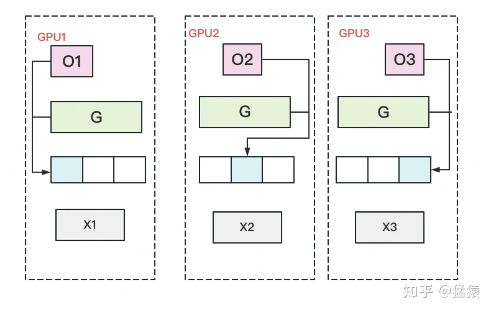

# 大模型分布式训练并行技术

通过本篇文档你将了解到什么？
1. 分布式训练架构
    - PS 架构
    - Collective 架构
2. 分布式并行策略
    - 数据并行
        - DP
        - DDP
        - FSDP
        - ZeRO
    - 张量并行
    - 流水线并行
        - GPipe

## 一、 分布式训练架构
### 1.1 参数服务器（PS）架构 （中心化）- 参数统一由 Server 更新和分发

参数服务器架构主要包含 Server 和 Worker 两个部分，其中 Server 负责参数的存储和更新，Worker 负责训练。当训练数据过多，一个 Worker 训练太慢时，可以引入多个 Worker 同时训练。Server 充当 Worker 之间参数交换的媒介。当模型参数过大导致 Server 是一个瓶颈时，就需要引入多个 Server。


+ 参数更新流程：
    + 数据划分：
        + 训练数据均匀的分给不同的 Worker。
    + 梯度计算：由 Worker 端执行
        + 读取分配的数据
        + 从 Server 端拉取最新的模型参数
        + 前向 + 反向 计算损失函数的梯度（对所有参数的梯度）
        + 发送给参数服务器
    + 梯度聚合：由 Server 端执行
        + 接收 Worker 端发来的所有参数梯度信息
        + 以某种算法对各个 Worker 发来的参数梯度信息进行聚合（平均或其他方式） ，对所有参数得到一个聚合后全局梯度。
    + 全局梯度应用： 由 Server 端执行
        + 参数服务器将全局梯度应用于模型参数，对参数进行更新。
    + 更新分发：
        + 更新后的模型参数，等待下一次迭代，Worker 端的请求
    + 迭代更新
        + 以上步骤在每一轮迭代中重复进行，直到模型收敛或达到预设的迭代次数。

+ Server 端以何种方式进行参数更新(根据 Server 端是否等待所有 Worker 执行完在同步参数分为如下几种方式)：
    
    + 同步训练
        - 特点：Worker在训练一个batch的数据后，会合并所有线程的梯度发给Server, Server在收到所有节点的梯度后，会统一进行梯度合并及参数更新。
        - 优点：同步训练的优势在于Loss可以比较稳定的下降，
        - 缺点：整个训练速度较慢，这是典型的木桶原理，速度的快慢取决于最慢的那个线程的训练计算时间。Server 的带宽将会成为整个系统的计算效率的瓶颈。
        - 使用场景：因此在训练较为复杂的模型时，即模型训练过程中神经网络训练耗时远大于节点间通信耗时的场景下，推荐使用同步训练模式。
    + 异步训练
        - 特点：在训练一个batch的数据后，Worker的每个线程会发送梯度给Server。而Server不会等待接收所有节点的梯度，而是直接基于已收到的梯度进行参数更新。
        - 优点：异步训练去除了训练过程中的等待机制，训练速度得到了极大的提升，
        - 缺点：缺点也很明显，那就是Loss下降不稳定，容易发生抖动。
        - 使用场景：建议在个性化推荐（召回、排序）、语义匹配等数据量大的场景使用。尤其是推荐领域的点击率预估场景，该场景可能会出现千亿甚至万亿规模的稀疏特征，而稀疏参数也可以达到万亿数量级，且需要小时级或分钟级流式增量训练。如果使用异步训练模式，可以很好的满足该场景的online-learning需求。
    + GEO 异步训练
        - 特点：GEO(Geometric Stochastic Gradient Descent)异步训练是飞桨自研的异步训练模式，其最大的特点是将参数的更新从Server转移到Worker上。每个Worker在本地训练过程中会使用SGD优化算法更新本地模型参数，在训练若干个batch的数据后，Worker将发送参数更新信息给Server。Server在接收后会通过加和方式更新保存的参数信息。
        - 优点：显而易见，在GEO异步训练模式下，Worker不用再等待Server发来新的参数即可执行训练，在训练效果和训练速度上有了极大的提升
        - 使用场景：此模式比较适合可以在单机内能完整保存的模型，在搜索、NLP等类型的业务上应用广泛，推荐在词向量、语义匹配等场景中使用。

+ 参数服务器架构使用场景：对于存储超大规模模型参数的训练场景十分友好，常被用于训练拥有**海量稀疏参数的搜索推荐领域模型**。

### 1.2  集合通信架构（All-Reduce Collective）- 参数由 Worker 之间互相同步

Collective 架构是一种去中心化的、基于规约模式的架构，也是近年来非常流行的分布式训练架构。该架构没有所谓管理模型参数的中心节点，每个设备都是Worker，节点间通过 Collective 集合通信原语通信，因此也称为 Collective 架构。一种典型的集合通信原语是基于 NVIDIA NCCL 通信库的集合通信原语。

+ 什么是集合通信原语？
    + 集合通信 （Collective Communications） 是一个进程组的所有进程都参与的全局通信操作，其最为基础的操作有：
        - 发送 send
        - 接收 receive
        - 复制 copy
        - 组内进程栅障同步 barrier
        - 节点间的进程同步 （signal + wait）
    + 通信原语： 上述几个基本的操作组合构成了一组通信模板，也叫通信原语
        - 一对多的广播 broadcast
        - 多对一的收集 gather
        - 多对多的收集 all-gather
        - 1对多的发散 scatter
        - 多对一的规约 reduce
        - 多对多的规约 all-reduce
            - 从多个sender那里接收数据，最终combine到每一个节点上。
             
        - 组合的规约与发散 reduce-scatter
        - 多对多的 all-to-all 等
    + 参考链接： 分布式训练—集合通信及其通信原语 - (https://blog.csdn.net/weixin_44966641/article/details/131756853)
    + 这些通信原语都是以算子的形式出现，同一类算法根据硬件不同，调用的底层通讯库接口不同，所以实现区分不同硬件。例如在 Paddle 代码中：通信库算子实现在
    
    其中，xpu 算子基于 xpu BKCL 通信库实现，gpu 算子基于 NCCL 或 RCCL 通信库实现。


+ 集合通信架构(通信拓扑优化技术)：**不同方式的拓扑结构， 旨在减少系统的通讯压力**。

    各个 worker 之间点对点通信，进行参数更新。当对所有样本产生的参数梯度进行全局同步后，由每个 Worker 独立执行优化算法，相当于优化了全局的模型参数。

    - 方式一（简单）
        - 每个worker将自己的数据发给其他的所有worker，然而这种方式存在大量的浪费。
        
    - 方式二
        - 主从式架构 - 将一个worker设为master，其余所有worker把数据发送给master之后，由master进行整合元算，完成之后再分发给其余worker。不过这种实现 master往往会成为整个网络的瓶颈。
        
        
    - 方式三
        - Ring AllReduce 架构: 每个 GPU 只从左邻居接受数据、并发送数据给右邻居。
        
        算法主要分两步：
            - scatter-reduce(add 操作)：会逐步交换彼此的梯度并融合，最后每个 GPU 都会包含完整融合梯度的一部分。
            - allgather（替换操作）：GPU 会逐步交换彼此不完整的融合梯度，最后所有 GPU 都会得到完整的融合梯度。
        - scatter-reduce
          - Step1：将梯度数组在每个GPU上都分块。GPU 1 ~ GPU N 被分配了不同 mini-batch 的数据，a - e 可以认为是原始模型中有五层网络，分别代表五层权重。在之前的架构中，a - e 被作为一个整体。现在需要对他进行拆分，分别是 a - e。不同 batch 在各个 GPU 上训练完成之后，需要彼此之间进行梯度合并。  
          
          - Step2：N-1轮的scatter-reduce，每一轮中，每个GPU将自己的一个chunk发给右邻居，并接收左邻居发来的chunk，并累加。
          
          
          
          
          
        - Allgather : 
            - 和scatter-reduce操作类似，只不过将每个chunk里面的操作由累加值变为替换。   
            
            
            
            
            
        - 通信代价分析：
            - 每个 GPU 在Scatter Reduce 阶段，接收 N-1 次数据，N 是 GPU 数量；每个 GPU 在allgather 阶段，接收 N-1 次 数据；每个 GPU 每次发送 K/N 大小数据块，K 是总数据大小；所以，Data Transferred=2(N−1)*K/N ，随着 GPU 数量 N 增加，**总传输量恒定**。
        - 好处：
            - 充分的利用了集群中每个节点的带宽，不用一次性传输大量的数据。
            - 梯度计算和节点梯度传递并行，进一步减少训练时间
                - 深度学习训练过程中，计算梯度采用 BP 算法，其特点是后面层的梯度先被计算，因此在前面层梯度计算的同时同时进行后面层梯度的传递。
            - 经验证，这种方式的训练速度基本上线性正比于 GPUs 的数目。
            - 对于 master架构，master GPU 的通信时间是随着 GPU 卡数的增长而线性增长的。因为 master GPU 需要从其他 gpu 上收集训练的梯度，然后在将更新好的模型分发到其他的 GPU 上。

    - 方式四
        - 层次化通信方式
        
        - Worker 分成若干个组，组内选出一个 master，组内执行 AllReduce，master 得到组内汇聚的结果。 各个组的 master 在执行 AllReduce 操作。
        - master 设备上等价于获取了所有设备的汇聚结果。最后，各个组间 master 设备将其结果广播给组内的其它设备。
        

+ 集合通信架构使用场景：该架构往往是由高算力计算芯片通过高速网络互联而成，如高性能计算的 GPU 之间的高速网络互联 NVLINK 和 InfiniBand 等，该架构对于计算密集的任务非常友好， 因此非常适合 CV 和 NLP 领域的计算密集型训练任务。例如机器翻译中的Transformer，图像分类中的ResNet50，语音识别中的DeepSpeech2通常都是采用这种训练架构完成。

### 1.3 如何理解分布式训练架构
分布式训练架构无论是 PS 架构还是 Collective 架构，他们只是一种编程范式，大家处理的任务都是一样的，旨在描述训练任务如何切分，梯度如何聚合，参数如何更新，提高训练速度。反应到底层，无非是计算图的不同，根据目标训练硬件的计算效率 + 通信库效率等因素，在根据不同的业务场景选择不同的方法。


## 二、 分布式训练的并行方式

### 2.1 数据并行

数据并行，是最常见的并行形式，因为它很简单。 在数据并行训练中，数据集被分割成几个碎片，每个碎片被分配到一个设备上，每个设备将持有一个完整的模型副本，并在分配的数据集碎片上进行训练。在反向传播之后，模型的梯度将被全部减少，以便在不同设备上的模型参数能够保持同步。典型的数据并行实现：PyTorch DDP。


#### 2.1.1 PyTorch DP
1. 介绍

    数据并行(torch.nn.DataParallel)，这是Pytorch最早提供的一种数据并行方式，它基于**单进程多线程**进行实现的，它使用一个进程来计算模型权重，在**每个批处理期间**将数据分发到每个GPU，是一个基于参数服务器架构的编程模式。

2. 计算流程
    - 将 inputs 从主 GPU 分发到所有 GPU 上。
    - 将 model 从主 GPU 分发到所有 GPU 上。
    - 每个 GPU 分别独立进行前向传播，得到 outputs。
    - 将每个 GPU 的 outputs 发回主 GPU。
    - 在主 GPU 上，通过 loss function 计算出 loss，对 loss function 求导，求出损失梯度。
    - 计算得到的梯度分发到所有 GPU 上。
    - 反向传播计算参数梯度。
    - 将所有梯度回传到主 GPU，通过梯度更新模型权重。
    - 不断重复上面的过程。

    

3. 流程示意简化
    ```
                                主进程 Master GPU
                                        |
                                    分发数据和模型
                                        |
            -  -  -  -  -  -  -  -  -  -  -  -  -  -  -  -  -  -  -
            |                  |               |                |
        Worker GPU 1       Worker GPU 2     ......         Worker GPU N
            |                  |               |                |
            前向计算             前向计算          前向计算          前向计算
            |                  |               |                |
            output 1           output 2       ......            output N
            |                  |               |                |
            -  -  -  -  -  -  -  -  -  -  -  -  -  -  -  -  -  -  -
                                        |
                                主进程  Master GPU
                                        |
                            收集 output 1 ~ N 并计算 Loss 
                                        |
                            对 loss function 求导，求出损失梯度
                                        |
            -  -  -  -  -  -  -  -  -  -  -  -  -  -  -  -  -  -  - 
            |                  |               |                 |
        Worker GPU 1       Worker GPU 2       ......         Worker GPU N
            |                  |               |                 |
            反向计算             反向计算          反向计算          反向计算
            |                  |               |                 |
            梯度 1              梯度 2            ......           梯度 N
            |                  |               |                 |
            -  -  -  -  -  -  -  -  -  -  -  -  -  -  -  -  -  -  -
                                        |
                                主进程  Master GPU
                                        |
                                汇总梯度 1 ~ N                                       
                                        |                                             
                            根据汇总梯度得到的值，使用梯度下降法更新模型权重                
                                        |                                             
                                        |  Loop
                                
    ```

4. 缺点
    - 单进程多线程带来的问题：DataParallel使用单进程多线程进行实现的，方便了信息的交换，但受困于 GIL，会带来性能开销，速度很慢。而且，只能在单台服务器（单机多卡）上使用（不支持分布式）。同时，不能使用 Apex 进行混合精度训练。
        - Tips: GIL 锁如何影响 python 多线程：https://blog.csdn.net/u013531487/article/details/131321794
    - 效率问题，主卡性能和通信开销容易成为瓶颈，GPU 利用率通常很低：数据集需要先拷贝到主进程，然后再分片（split）到每个设备上；权重参数只在主卡（GPU0）上更新，需要每次迭代前向所有设备做一次同步；**每次迭代的网络输出需要聚集到主卡（GPU0）上**。因此，通信很快成为一个瓶颈。除此之外，这将导致主卡和其他卡之间，GPU利用率严重不均衡（比如：主卡使用了10G显存，而其他卡只使用了2G显存，batch size稍微设置大一点主卡的显存就OOM了）。
    - 不支持模型并行，由于其本身的局限性，没办法与模型并行组合使用.


#### 2.1.2 PyTorch DDP
DP 采用参数服务器架构，通讯负载不均衡。DDP 首先解决是通讯问题：将 Server 上的通讯压力均衡转到各个 Worker 上，采用 All-Reduce collective 架构。
1. 介绍

    分布式数据并行(torch.nn.DistributedDataParallel)，基于多进程进行实现的，每个进程都有独立的优化器，执行自己的更新过程。每个进程都执行相同的任务，并且每个进程都与所有其他进程通信。进程（GPU）之间只传递梯度，这样网络通信就不再是瓶颈。

    

2. 计算流程
    - 首先将 rank=0 进程中的模型参数广播到进程组中的其他进程；
    - 然后，每个 DDP 进程都会创建一个 local Reducer 来负责梯度同步。
    - 在训练过程中，每个进程从磁盘加载 batch 数据，并将它们传递到其 GPU。每个 GPU 都有自己的前向过程，完成前向传播后，梯度在各个 GPUs 间进行 All-Reduce，每个 GPU 都收到其他 GPU 的梯度，从而可以独自进行反向传播和参数更新。
    - 同时，每一层的梯度不依赖于前一层，所以梯度的 All-Reduce 和反向过程同时计算，以进一步缓解网络瓶颈。
    - 在反向过程的最后，每个节点都得到了平均梯度，这样各个 GPU 中的模型参数保持同步。

3. DP 和 DDP 的区别
    + 实现方式不同
        + DP 是基于单进程多线程的实现，只用于单机多卡情况。主从架构，通讯负载不均衡。
        + DDP 是多进程实现的，每个 GPU 对应一个进程，适用于单机和多机情况，真正实现分布式训练，并且因为每个进程都是独立的 Python 解释器，DDP 避免了 GIL 带来的性能开销。
    + 参数更新的方式不同
        + DDP 在各进程梯度计算完成之后，各进程需要将梯度进行汇总平均, 各进程用该梯度来独立更新参数
        + DP 是梯度汇总到 GPU0, 由 GPU0 进行更新参数，在广播给其他剩余的 CPU
        + DDP 传输的数据更少，训练更高效，不存在 DP 中负载不均衡的问题。
    + DP 和 DDP 的全卡总通讯量相同，但搬运相同数据量的时间不一定相同。DDP 把通讯量均衡负载到了每一时刻的每个 Worker 上，而 DP 仅让 Server 做勤劳的搬运工。但是参数服务器其实也提供了多个 Server 的方法，也会一定程度上减少 Server 的带宽压力，所以经过调整设计后，也可以用来做 DDP。
    + DDP 支持模型并行，而 DP 不支持，这意味如果模型太大单卡显存不足时，只能使用DDP。


#### 2.1.3 ZeRO(Zero Redundancy Optimizer) 技术
DP 和 DDP 会在每个 GPU 上做一份完整模型的拷贝，所以显存利用率不高。ZeRO 技术用于解决显存问题。
- 优化的总体思路
    能切分就切分，需要的用的时候，从别的 GPU 聚合过来即可。
- Question ?
    - GPT-2 模型参数 1.5B, 权重只需要 3GB 如果用 16-bit 精度存储，但是用单 GPU（32 GB） 使用 tensorflow 或 pytorch 却训练不起来， 那么这些内存都去哪儿了？ 

##### 2.1.3.1 训练中的显存存储分析

ZeRO 将模型训练阶段， 每张卡种的显存内容分为两类：


+ 模型状态：指和模型本身息息相关的，必须存储的内容
    - 优化器状态
        - Adam 优化器
            - 一阶动量 - momentum
            - 二阶动量 - variance
        - 混合精度优化器（Mixed-Precision Training） 
            - fp16 权重大小 2N
            - fp16 权重梯度大小 2N
            - 优化器状态(占比过高)：
                - fp32 权重大小  4N
                - fp32 momentum 大小 4N
                - fp32 variance 大小 4N
                - 其他额外内存： KN (K 是优化器状态的内存乘数), 其中 Adam 混合精度优化器中： K = 12
                备注： 优化器状态的内存乘数（K）是指存储优化器状态所需的额外内存量。这个概念主要用于混合精度训练，表示每个浮点运算需要的额外内存。K值的计算与模型大小、DP并行度以及GPU有关。
    - gradients: 模型梯度
    - parameters: 模型参数 Weights
+ 剩余状态（碎片内存）指并非模型非必须的，但在训练过程中会额外产生的内容。
    - activation: 在backward过程中使用链式法则计算梯度时会用到。有了它算梯度会更快，但它不是必须存储的，因为可以通过重新做Forward来算它。
        - sequence length of 1K
        - batch size of 32 
        需要 60GB 的内存  -> 通过 checkpointing 技术 -> 8GB
    - temporary buffers: 临时 buffer,例如把梯度发送到某块GPU上做加总聚合时产生的存储。
        - 存储中间结果
        - all-reduce, gradient norm
    - unusable fragment memory:碎片化的存储空间。
        - 虽然总存储空间是够的，但是如果取不到连续的存储空间，相关的请求也会被fail掉。对这类空间浪费可以通过内存整理来解决。

+ 存储大小


通常来说，在模型训练的过程中，GPU 上需要进行存储的参数包括了模型本身的参数、优化器状态、激活函数的输出值、梯度以及一些临时的 Buffer。各种数据的占比如图所示：


可以看到模型参数仅占模型训练过程中所有数据的一部分，当进行混合精度运算时，其中模型状态参数(优化器状态 + 梯度+ 模型参数）占到了一大半以上。因此，我们需要想办法去除模型训练过程中的冗余数据。

##### 2.1.3.2 ZeRO-DP (对模型状态进行优化)

<!-- DP 和 MP 存在的问题：
+ DP比MP具有更好的扩展效率，因为MP降低了计算的粒度，同时也增加了通信开销。在超过某个点后，较低的计算粒度会降低每个GPU的效率，而增加的通信开销会阻碍跨GPU的可扩展性，特别是在跨越节点边界时。相反，DP具有更高的计算粒度和更低的通信量，因此可实现更高的效率。
+ DP由于在所有数据并行进程中冗余地存储了模型状态，因此DP是内存不高效的。相反，MP对模型状态进行分区以获得内存效率。
+ DP和MP都保留整个训练过程中所需的所有模型状态，但并不是所有状态都需要一直存在。例如，对应于每个层的参数仅在层的正向传播和反向传播期间需要。这表示，可以分别保存每个层的参数，并在训练期间按需加载。此外，如果正在训练特定场景，则只需要加载与该场景相关的参数。这可以显著降低训练期间所需的内存量，尤其是在大型模型的情况下。 -->

针对模型状态的存储优化（去除冗余），DeepSpeed 提出了 ZeRO，ZeRO 使用的方法是分片，即每张卡只存 1/N 的模型状态量，这样系统内只维护一份模型状态参数。

    
ZeRO对 模型状态（Model States）参数进行不同程度的分割，主要有三个不同级别：
+ ZeRO-1 : 优化器状态分片（ Optimizer States Sharding）
    - 首先，从 optimizer state开始优化。将optimizer state分成若干份，每块GPU上各自维护一份。这样就减少了相当一部分的显存开销。如下图：
    
    此时W=fp16，G=fp16，O=fp32。此时，整体数据并行的流程如下：

        （1）每块GPU上存一份完整的参数W。将一个batch的数据分成3份，每块 GPU 各吃一份，做完一轮 foward 和 backward 后，各得一份梯度。

        （2）对梯度做一次AllReduce，得到完整的梯度G，产生单卡通讯量 2N。

        （3）得到完整梯度 G，就可以对 W 做更新。我们知道 W 的更新由 optimizer states 和梯度共同决定。由于每块 GPU上 只保管部分 optimizer states，因此只能将相应的 W（蓝色部分）进行更新。
        
        （4）此时，每块GPU上都有部分W没有完成更新（图中白色部分）。所以我们需要对W做一次All-Gather，从别的GPU上把更新好的部分W取回来。产生单卡通讯量 N。

    ZeRO-1 阶段做完过后， 设 GPU 的个数为 Nd，显存和通讯量的情况如下：
    
    **ZeRO-1 在增加 1.5 倍单卡通讯开销的基础上，将单卡存储降低了 4 倍**。
+ ZeRO-2 : 优化器状态与梯度分片（Optimizer States & Gradients Sharding）
    - 更近一步，我们把梯度也拆开，每个GPU格子维护一块梯度。
    
    此时，数据并行的整体流程如下：
        （1）每块GPU上存一份完整的参数W。将一个batch的数据分成3份，每块GPU各吃一份，做完一轮foward和backward后，算得一份完整的梯度（下图中绿色+白色）。

        （2）对梯度做一次Reduce-Scatter，保证每个GPU上所维持的那块梯度是聚合梯度。例如对GPU1，它负责维护G1，因此其他的GPU只需要把G1对应位置的梯度发给GPU1做加总就可。汇总完毕后，白色块对GPU无用，可以从显存中移除。单卡通讯量 N。

        
        （3）每块GPU用自己对应的O和G去更新相应的W。更新完毕后，每块GPU维持了一块更新完毕的W。同理，对W做一次All-Gather，将别的GPU算好的W同步到自己这来。单卡通讯量 N。

    ZeRO-2 阶段做完过后， 设 GPU 的个数为 Nd，显存和通讯量的情况如下：
    
+ ZeRO-3 : 优化器状态、梯度和模型权重参数分片（Optimizer States & Gradients & Parameters Sharding）
    - ZeRO的思想就是：万物皆可切，万物皆可抛。所以现在，我们把参数也切开。每块GPU置维持对应的 optimizer states，gradients和parameters。
    
    数据并行的流程如下：
        （1）每块GPU上只保存部分参数W。将一个batch的数据分成3份，每块GPU各吃一份。

        （2）做forward时，对 W 做一次 All-Gather，取回分布在别的 GPU上的 W，得到一份完整的 W，单卡通讯量 N。forward做完，立刻把不是自己维护的 W 抛弃。

        （3）做backward时，对W做一次All-Gather，取回完整的W，单卡通讯量 N。backward做完，立刻把不是自己维护的 W 抛弃。

        （4）做完backward，算得一份完整的梯度 G，对 G 做一次 Reduce-Scatter，从别的 GPU 上聚合自己维护的那部分梯度，单卡通讯量。聚合操作结束后，立刻把不是自己维护的 G 抛弃。

        （5）用自己维护的 O和 G，更新 W。由于只维护部分 W，因此无需再对 W 做任何 AllReduce 操作。

    ZeRO-3 阶段做完过后， 设 GPU 的个数为 Nd，显存和通讯量的情况如下：
    
    - 成果：**用1.5倍的通讯开销，换回近120倍的显存**。

ZeRO 不同 stage 内存使用情况：


##### 2.1.3.3 ZeRO-R (对剩余状态进行优化)
+ Partitioned Activation Checkpointing
    - 对激活检查点进行切分，每个 GPU 只维护部分 activation，需要时再从别的地方聚合过来即可。
    - 对于非常大的模型，ZeRO甚至可以选择将激活分区移动到 CPU 内存中，同时由于这些模型中的算术强度很大而仍然实现良好的效率。
+ Constant Size Buffer
    - 提升带宽利用率。当GPU数量上升，GPU间的通讯次数也上升，每次的通讯量可能下降（但总通讯量不会变）。数据切片小了，就不能很好利用带宽了。所以这个buffer起到了积攒数据的作用：等数据积攒到一定大小，再进行通讯。
    - 使得存储大小可控。在每次通讯前，积攒的存储大小是常量，是已知可控的。更方便使用者对训练中的存储消耗和通讯时间进行预估。
+ Memory Defragmentation: 内存碎片整理
    - ZeRO 通过将激活检查点和梯度移动到预先分配的连续内存缓冲区来实现内存的动态碎片整理。这不仅增加了内存可用性，还减少了内存分配器查找连续空闲内存所需的时间，从而提高效率。

##### 2.1.3.4 ZeRO-Offload
+ 核心思想： 显存不够，内存来凑。如果我把要存储的大头卸载 (offload) 到 CPU 上，而把计算部分放到 GPU 上，这样比起跨机，是不是能既降显存，也能减少一些通讯压力呢？
+ ZeRO-Offload的做法:
    + forward 和 backward 计算量高，因此和它们相关的部分，例如参数W（fp16），activation，就全放入 GPU。
    + update 的部分计算量低，因此和它相关的部分，全部放入CPU中。例如 W (fp32)，optimizer states（fp32）和 gradients (fp16) 等。

    

##### 2.1.3.5 ZeRO Vs 模型并行
知道模型并行的朋友，可能会想，既然ZeRO都把参数W给切了，那它应该是个模型并行呀？为什么要归到数据并行里呢？
- **其实ZeRO是模型并行的形式，数据并行的实质。**
- 模型并行，是指在 forward和 backward 的过程中，我只需要用自己维护的那块 W 来计算就行。即**同样的输入X，每块GPU上各算模型的一部分，最后通过某些方式聚合结果**。
- 但对ZeRO来说，它做 forward 和 backward 的时候，是需要把各 GPU上 维护的 W 聚合起来的，即本质上还是用完整的 W 进行计算。**它是不同的输入X，完整的参数W，最终再做聚合**。

##### 2.1.3.6 ZeRO Infinity 
DeepSpeed 假设了单层参数量可以在单张显卡上放得下，如果不满足这个假设，那么仍然需要使用模型并行。

当单层参数量在单张显卡上放不下的时候，它通过对这一层算子切片，一片一片来执行，使得单卡也能跑得起来一个巨大的层，可以理解成一种 “时间”轴上展开的模型并行。

论文链接：https://arxiv.org/abs/2104.07857

#### 2.1.4 Pytorch FSDP (完全分片数据并行)
Pytorch FSDP  受 DeepSpeed ZeRO 启发而获得灵感。

完全分片数据并行(torch.distributed.fsdp.FullyShardedDataParallel)，是Pytorch最新的数据并行方案，在 1.11 版本引入的新特性，目的主要是用于训练大模型。**Pytorch DDP 用起来简单方便，但是要求整个模型加载到一个GPU上，这使得大模型的训练需要使用额外复杂的设置进行模型分片**。因此，为了打破模型分片的障碍（包括模型参数，梯度，优化器状态）；同时，仍然保持了数据并行的简单性，该新特性应运而生。

FSDP 是一种新型数据并行训练方法, 但与传统的数据并行不同，传统的数据并行维护模型参数、梯度和优化器状态的每个 GPU 副本，而 FSDP 将所有这些状态跨数据并行工作线程进行分片，并且可以选择将模型参数分片卸载到 CPU。可以认为 FSDP 是 ZeRO-stage3 的实现版本。

下图显示了 FSDP 如何在 2 个数据并行进程中工作流程：


- 原理：解锁 ZeRO/FSDP 的关键是我们可以把 DDP 之中的 All-Reduce 操作分解为独立的 Reduce-Scatter 和 All-Gather 操作。

    

    All-Reduce 是 Reduce-Scatter 和 All-Gather 的组合。聚合梯度的标准 All-Reduce 操作可以分解为两个单独的阶段。
    - Reduce-Scatter 阶段，在每个GPU上，会基于 rank 索引对 rank 之间相等的块进行求和。
    - All-Gather 阶段，每个GPU上的聚合梯度分片可供所有GPU使用。

    通过重新整理 Reduce-Scatter 和 All-Gather，每个 DDP worker只需要存储一个参数分片和优化器状态。


- 如何应用?
    - 模型层以嵌套方式用 FSDP 包装，生成 FSDP 实例，只有**单个 FSDP 实例**中的层需要在前向或后向计算期间将完整参数收集到**单个设备**
    - 计算完成后，收集到的完整参数将立即释放，释放的内存可用于下一层的计算。通过这种方式，可以节省峰值 GPU 内存，从而可以扩展训练以使用更大的模型大小或更大的批量大小。为了进一步最大化内存效率，当实例在计算中不活动时，FSDP 可以将参数、梯度和优化器状态卸载到 CPU。
    - FSDP 实例包装
        - 自动包装（Auto Wrapping）它可以作为 DDP 的直接替代品，而无需更改其余代码。
            
                fsdp_auto_wrap_policy 参数允许指定可调用函数以使用 FSDP 递归地包裹层。 PyTorch FSDP提供的default_auto_wrap_policy 函数递归地包裹参数数量大于 100M 的层。当然，您也可以根据需要提供自己的包装策略。
                此外，可以选择配置 cpu_offload，以便在计算中不使用包装参数时将这些参数卸载到 CPU。 这可以进一步提高内存效率，但代价是主机和设备之间的数据传输开销。

            - 代码示例：
            ```
            from torch.distributed.fsdp import (
                FullyShardedDataParallel,
                CPUOffload,
                )
                from torch.distributed.fsdp.wrap import (
                default_auto_wrap_policy,
                )
                import torch.nn as nn
                
                class model(nn.Module):
                def __init__(self):
                    super().__init__()
                    self.layer1 = nn.Linear(8, 4)
                    self.layer2 = nn.Linear(4, 16)
                    self.layer3 = nn.Linear(16, 4)
                
                model = DistributedDataParallel(model())
                fsdp_model = FullyShardedDataParallel(
                model(),
                fsdp_auto_wrap_policy=default_auto_wrap_policy,
                cpu_offload=CPUOffload(offload_params=True),
                )

            ```
        - 手动包装（Manual Wrapping）需要对模型定义代码进行少量的更改，并且能够探索复杂的分片策略。

            通过有选择地对模型的某些部分应用包装，手动包装对于探索复杂的分片策略非常有用。 总体设置可以传递给enable_wrap()上下文管理器。

                from torch.distributed.fsdp import (
                    FullyShardedDataParallel,
                    CPUOffload,
                )
                from torch.distributed.fsdp.wrap import (
                    enable_wrap,
                    wrap,
                )
                import torch.nn as nn
                from typing import Dict
                
                
                class model(nn.Module):
                def __init__(self):
                    super().__init__()
                    self.layer1 = wrap(nn.Linear(8, 4))
                    self.layer2 = nn.Linear(4, 16)
                    self.layer3 = wrap(nn.Linear(16, 4))
                
                wrapper_kwargs = Dict(cpu_offload=CPUOffload(offload_params=True))
                with enable_wrap(wrapper_cls=FullyShardedDataParallel, **wrapper_kwargs):
                fsdp_model = wrap(model())

+ DDP 与 FSDP 的区别

    - DDP
        - 每个 Worker 保存模型参数副本
        - 前向计算：不需要进行 ALL-Gather 操作，Worker 独自完成前向计算
        - 反向计算：不需要进行 ALL-Gather 操作，Worker 独自完成前向计算
        - 参数更新：梯度聚合需要 AllReduce 操作，进行梯度同步，完成参数更新
    - FSDP
        - 每个 Worker 保存模型参数分片
        - 前向计算：需要进行 ALL-Gather 操作，获取完整模型参数，Worker 独自完成前向计算
        - 反向计算：需要进行 ALL-Gather 操作，获取完整模型参数，Worker 独自完成前向计算
        - 参数更新：每个 GPU 的局部梯度被聚合并且通过 Reduce-Scatter 在各个GPU上分片，每个分片上的梯度是聚合之后本分片对应的那部分。每个 GPU 只更新其自己对应的那部分权重分片。


<!-- ### 2.2 模型并行
在数据并行训练中，一个明显的特点是每个 GPU 持有整个模型权重的副本。这就带来了一些冗余问题。另外一种并行模式是模型并行，即模型被分割并分布在一个设备阵列上。通常有两种类型的模型并行： 张量并行和流水线并行。
- 张量并行 - 层内并行，在一个操作中进行并行计算 如：矩阵乘法。
- 流水线并行 - 层间并行，在各层之间进行并行计算。 -->


<!-- #### 2.2.1 张量并行
张量并行训练是将一个张量沿特定维度分成 N 块，每个设备只持有整个张量的 1/N，同时不影响计算图的正确性。这需要**额外的通信**来确保结果的正确性。

以一般的矩阵乘法为例，假设我们有 C = AB。我们可以将B沿着列分割成 [B0 B1 B2 ... Bn]，每个设备持有一列。然后我们将 A 与每个设备上 B 中的每一列相乘，我们将得到 [AB0 AB1 AB2 ... ABn] 。此刻，每个设备仍然持有一部分的结果，例如，设备(rank=0)持有 AB0。为了确保结果的正确性，我们需要收集全部的结果，并沿列维串联张量。通过这种方式，我们能够将张量分布在设备上，同时确保计算流程保持正确。典型的张量并行实现：Megatron-LM（1D）、Colossal-AI（2D、2.5D、3D）。


#### 2.2.2 流水线并行
流水线并行的核心思想是，模型按层分割成若干块，每块都交给一个设备。
- 在前向传播过程中，每个设备将中间激活传递给下一个阶段。
- 在后向传播中，每个设备将输入张量的梯度传回给前一个流水线阶段。

这允许设备同时进行计算，从而增加训练的吞吐量。


流水线并行训练的一个明显缺点是：训练设备容易出现空闲状态（因为后一个阶段需要等待前一个阶段执行完），导致计算资源的浪费，加速效率没有数据并行高。
典型的流水线并行实现：GPipe、PipeDream、PipeDream-2BW、PipeDream Flush（1F1B）。

1. 朴素流水线并行

模型按层间切分成多个部分，并将每个部分分配给一个 GPU。在模型切分成多个部分的边界处进行通信。


- 4 层网络朴素流水线示意


这里仅使用了点到点通信（MPI.Send 和 MPI.Recv），并且不需要任何集体通信原语（因此，不需要 MPI.AllReduce）

- 朴素流水线并行存在的问题
    - 任意给定时刻，除了一个 GPU 之外的所有 GPU 都是空闲的。因此，如果使用 4 个 GPU, 则几乎等同于单个 GPU 的内存量增加 4 倍，而其他计算资源没有运用上。所以朴素流水线会存在很多的 bubble，朴素流水线将会导致 **GPU 使用率过低**。 
    - 数据通信开销： 1 张 24 GB GPU 卡训练速度 >  4 张 6 GB GPU 卡训练速度 , 因为后者没有数据通信开销。
    - 通信和计算没有并行
    - 内存占用大：先执行前向传播的GPU（如：GPU1）将保留整个 batch 缓存的所有激活，直到最后。如果batch size很大，可能会产生内存问题。

2. 微批次流水线并行

微批次（MicroBatch）流水线并行与朴素流水线几乎相同，但它通过将传入的小批次（minibatch）分块为微批次（microbatch），并人为创建流水线来解决 GPU 空闲问题，从而允许不同的 GPU 同时参与计算过程，可以显著提升流水线并行设备利用率，减小设备空闲状态的时间。目前业界常见的流水线并行方法 GPipe 和 PipeDream 都采用微批次流水线并行方案。

+ 2.1 GPipe
    
    GPipe（Easy Scaling with Micro-Batch Pipeline Parallelism），由谷歌提出的一种流水线并行方案。GPipe 流水线并行主要用来解决两个问题
    - **提高模型训练的并行度**
        - Gpipe 在朴素流水线并行的基础上，利用数据并行的思想，将 mini-batch 细分为多个更小的 micro-batch，送入GPU进行训练，来提高并行程度。
        - 朴素流水线与 GPipe 微批次流水线并行对比，通过 GPipe 可以有效降低流水线并行 bubble 空间的比例。
            
    - **通过重计算降低显存消耗**
        - 在模型训练过程中的前向传播时，会记录每一个算子的计算结果，用于反向传播时的梯度计算。
            
        - **重计算并非是不需要中间结果，而是有办法在求导过程中实时的计算出之前被舍弃掉的中间结果** 
        - 重计算可以不用保存中间层输出的激活值，在计算梯度的时候会重新计算出来这些激活值从而可以计算梯度。在 GPipe 中，应用了这个技术后，如果一个设备上有多层，那么就可以只保存多层中的最后一层的输出值。这样就降低了每个设备上内存占用峰值，同样的模型尺寸需要的显存就少了。

    简而言之，GPipe 通过纵向对模型进行切分解决了单个设备无法训练大模型的问题；同时，又通过微批量流水线增加了多设备上的并行程度，除此之外，还使用重计算技术降低了单设备上的显存峰值。

+ 2.2 流水线并行策略
    + F-then-B 策略  
        F-then-B 模式，先进行前向计算，再进行反向计算。F-then-B 模式由于缓存了多个 micro-batch 的中间变量和梯度，**显存的实际利用率并不高**。
        
    + 1F1B 策略 
        1F1B（One Forward pass followed by One Backward pass）模式，一种前向计算和反向计算交叉进行的方式。在 1F1B 模式下，前向计算和反向计算交叉进行，可以及时释放不必要的中间变量。

        1F1B 示例如下图所示，以 stage4 的 F42（stage4 的第 2 个 micro-batch 的前向计算）为例，F42 在计算前，F41 的反向 B41（stage4 的第 1 个 micro-batch 的反向计算）已经计算结束，即可释放 F41 的中间变量，从而 F42 可以复用 F41 中间变量的显存。

        

        研究表明，1F1B 方式相比于 F-then-B 方式，**峰值显存可以节省 37.5%，对比朴素流水线并行峰值显存明显下降，设备资源利用率显著提升**。

## 五、 分布式框架


## 六、 常见加速库 -->

## QA
1. Q: 异步训练参数不同步模型如何收敛?
A: 异步训练中，不同节点上的模型参数可能会存在一定的偏差，这可能会影响模型的收敛。然而，在异步训练中，每个节点都会独立地进行反向传播和参数更新，最终的模型参数是由多个节点的参数更新平均得到的。这种更新方式类似于在多个副本上进行同步训练，然后对结果进行合并。
为了保证模型的收敛，可以采用一些技巧来减少不同节点之间的参数偏差。一种方法是采用折扣因子，对较早的参数更新进行折扣，使得最新的参数更新对模型的影响更大。另一种方法是采用平均策略，对不同节点的参数进行平均，以得到最终的模型参数。
此外，还可以采用一些调整参数更新的方法来提高模型的收敛性能。例如，可以采用Momentum方法来加速模型收敛，或者采用Adam等自适应学习率方法来自动调整学习率。
综上所述，异步训练虽然存在参数不同步的问题，但是在采取一些技巧和方法后，仍然可以实现模型的收敛。同时，需要注意对模型进行适当的调整和优化，以提高模型的性能和稳定性。